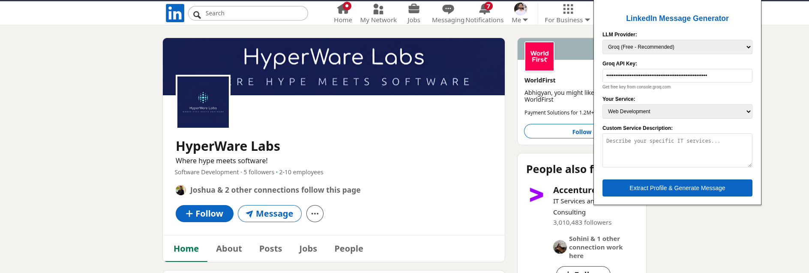

# Cold Message Generator Chrome Extension

Generate personalized LinkedIn connection request messages using AI, directly from any LinkedIn profile page.

---

## Screenshot

---

## Features

- Extracts LinkedIn profile data automatically
- Supports multiple LLM providers (Groq, Perplexity, Hugging Face, OpenAI)
- Customizable service/skills for message personalization
- Generates concise, professional messages (200 character limit)
- One-click copy to clipboard

---

## Installation

1. **Clone or Download the Repository**

   - Download this folder to your computer.

2. **Open Chrome Extensions Page**

   - Go to `chrome://extensions/` in your Chrome browser.
   - Enable **Developer mode** (toggle in the top right).

3. **Load the Extension**

   - Click **Load unpacked**.
   - Select the folder containing this codebase (where `manifest.json` is located).

4. **Pin the Extension (Optional)**
   - Click the puzzle icon in Chrome's toolbar.
   - Pin "Cold Message Generator" for quick access.

---

## Usage

1. **Open a LinkedIn Profile**

   - Navigate to any LinkedIn profile (URL should be like `https://www.linkedin.com/in/...`).

2. **Open the Extension Popup**

   - Click the "Cold Message Generator" icon in your Chrome toolbar.

3. **Configure Settings**

   - **LLM Provider:** Choose your preferred AI provider (Groq, Perplexity, Hugging Face, OpenAI).
   - **API Key:** Enter your API key for the selected provider. (Groq and Hugging Face offer free keys; see the popup for links.)
   - **Your Service:** Select your service type or choose "Custom" to describe your offering.
   - **Custom Service Description:** (If "Custom" is selected) Enter a brief description of your IT services.

4. **Extract Profile & Generate Message**

   - Click **Extract Profile & Generate Message**.
   - The extension will extract profile data and generate a personalized message using AI.

5. **Copy the Message**
   - Click **Copy Message** to copy the generated message to your clipboard.
   - You can also click **Generate New Message** to create another variation.

---

## Supported LLM Providers

- **Groq** (Recommended, Free): [Get API Key](https://console.groq.com)
- **Perplexity**: [Get API Key](https://www.perplexity.ai/settings)
- **Hugging Face** (Free): [Get Token](https://huggingface.co/settings/tokens)
- **OpenAI** (Paid): [Get API Key](https://platform.openai.com)

---

## Troubleshooting

- **API Key Required:** You must enter a valid API key for your selected provider.
- **Profile Extraction Fails:** Make sure you are on a LinkedIn profile page (`/in/` in the URL).
- **Message Not Generating:** Check your API key and internet connection. Some providers may have rate limits.

---

## Privacy & Security

- No data is sent to any server except the selected LLM provider for message generation.
- API keys are stored locally in your browser and never shared.

---

## Contributing

Pull requests and suggestions are welcome! Please open an issue for bugs or feature requests.

---

## License

MIT License
